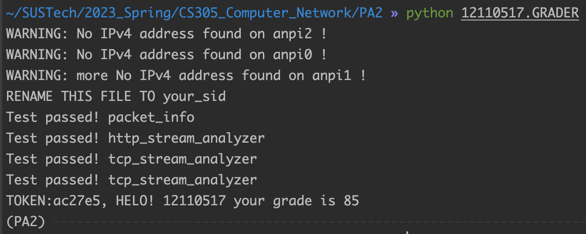
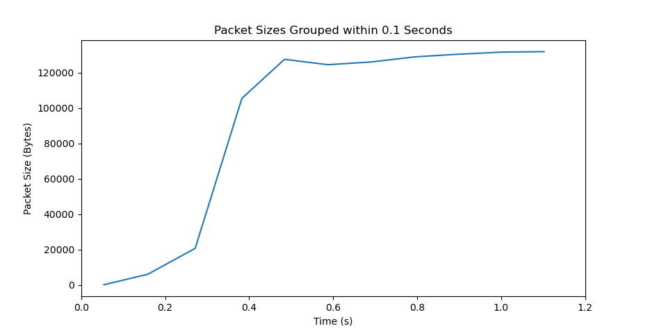
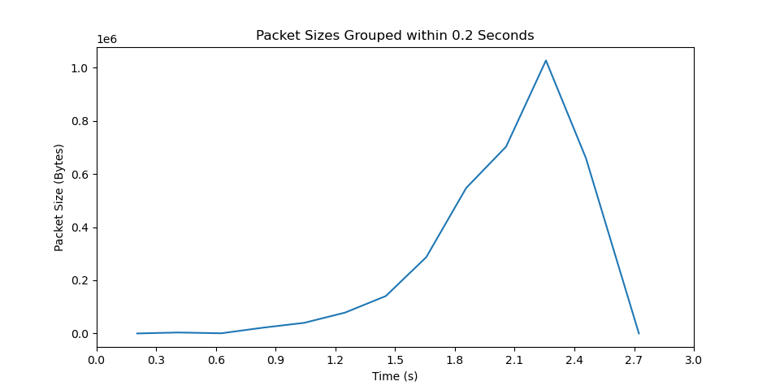
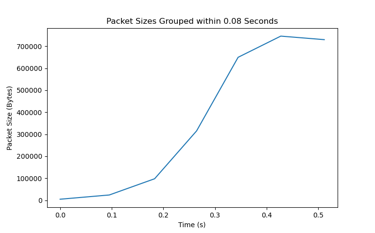

# CS305 PA2 Report

## Name: 钟志源

## SID: 12110517

### 1. Grader Screenshot



### 2. Task 2

#### Behavior: Slow Start

When a new TCP connection is established or when congestion is detected, the sender starts in slow start mode, where it sends a small number of packets (typically two) and then waits for ACKs from the receiver. For each ACK received, the sender increases its congestion window by one segment size (also known as the Maximum Segment Size, or MSS), effectively **doubling** the rate of transmission.

Slow start continues until either the congestion window reaches a pre-determined threshold (known as the slow start threshold or ssthresh), or until congestion is detected (i.e., packet loss occurs). 

#### Code Slip

```python
data[float(time - basetime)] = len(packet['TCP'])
# ‘data’ is dict type, key is the time, value is the packet size
```


```python
def draw(time_interval):  # Define the time interval to group packets within
    # Initialize lists to store the grouped packet sizes and timestamps
    grouped_packet_sizes = []
    grouped_timestamps = []

    # Loop through the dictionary and group packets within the time interval
    curr_packet_size = 0
    curr_timestamp = None
    for timestamp, packet_size in timedata.items():
        # Check if this is the first packet in the group
        if curr_timestamp is None:
            curr_timestamp = timestamp
            curr_packet_size = packet_size
        # Check if this packet is within the time interval of the current group
        elif timestamp - curr_timestamp <= time_interval:
            curr_packet_size += packet_size
        # This packet is outside the time interval of the current group, so start a new group
        else:
            grouped_packet_sizes.append(curr_packet_size)
            grouped_timestamps.append(curr_timestamp)
            curr_timestamp = timestamp
            curr_packet_size = packet_size
    # Add the last group to the list
    grouped_packet_sizes.append(curr_packet_size)
    grouped_timestamps.append(curr_timestamp)

    # Plot the new graph
    fig, ax = plt.subplots()
    # ax.plot(grouped_timestamps[0:len(grouped_timestamps) // 4], grouped_packet_sizes[0:len(grouped_packet_sizes) // 4])
    ax.plot(grouped_timestamps, grouped_packet_sizes)
    ax.set_xlabel('Time (s)')
    ax.set_ylabel('Packet Size (Bytes)')
    ax.set_title(f'Packet Sizes Grouped within {time_interval} Seconds')
    plt.show()
```

#### Figures

To simplify the process, I record the packet sizes of the packets sent by the server in the order of time. Then I group the size of packets within a time interval together and plot the graph. A packet's RTT fluctuates, but the average RTT for all packets within a time interval should be relatively stable. Therefore, assuming the RTT is relatively stable for every grouped time interval (the rate of receiving ACKs from the client is relatively stable), the packets total size per interval should reflect the slow start behaviour.

**Figure 1** shows the packet sizes grouped within every **0.1s** intervals. The scenario is downloading a pdf file from `https://sws.comp.nus.edu.sg/`. The first $1/4$ period of the TCP stream is taken, so the code slip has a small **modification**. 

```python
ax.plot(grouped_timestamps[0:len(grouped_timestamps)//4],
    grouped_packet_sizes[0:len(grouped_packet_sizes)//4])
```

The packet sizes are small at the beginning, and then increase quickly and finally reached a stable value. This accords to the slow start process that the transmission rate are increased after receiving an ack over time. After reaching the stable value (the possible threshold), the transmission rate is stable.




**Figure 2** shows the packet sizes grouped within every **0.2s** intervals. The scenario is downloading a file from `https://mirrors.tuna.tsinghua.edu.cn/`. This time it is more obvious that the packet sizes increase nearly exponentially till the transmission ends, again shows the behaviour of Slow Start.



Similarly, **Figure 3** shows the packet sizes grouped within every **0.08s** intervals. The first $1/2$ period of the TCP stream is taken, so the code slip has a small **modification**. The slope of the lines increased over time at the start, showing the speed up of transmission rate.

```python
ax.plot(grouped_timestamps[0:len(grouped_timestamps) // 2],
    grouped_packet_sizes[0:len(grouped_packet_sizes) // 2])
```



In conclusion, the behaviour of Slow Start is shown in the figures above.


